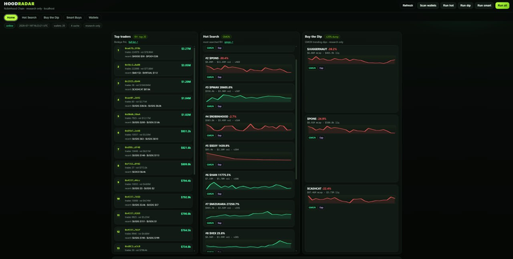

<p align="center">
  
</p>

<p align="center"><strong>Robinhood Chain research desk for Hermes Agent</strong></p>
<p align="center">Install on <strong>Nous Portal · Hermes Desktop · Hermes CLI</strong> · research only · no autotrade</p>

# hoodradar

> High-PnL wallets · honeypot filter · buy-the-dip · GMGN Hot Search  
> **Local web dashboard** (optional) · **customize the UI with Hermes**  
> **Built to run inside [Hermes Agent](https://hermes-agent.nousresearch.com/docs/)** — Telegram in, research briefs out.  
> **Your API keys stay on your machine.**

[](#)
[](#)
[](#)
[](#)

**Not affiliated with Robinhood Markets, Birdeye, GMGN, or Nous Research.**  
Read [DISCLAIMER.md](./DISCLAIMER.md) first.

---

## Who this is for

You already run (or will run) **Hermes Agent** via:

| Path | Docs |
|------|------|
| **Nous Portal** (hosted) | [portal.nousresearch.com](https://portal.nousresearch.com) · [Run with Portal](https://hermes-agent.nousresearch.com/docs/guides/run-hermes-with-nous-portal) |
| **Hermes Desktop** | [Hermes docs home](https://hermes-agent.nousresearch.com/docs/) |
| **Hermes CLI** | [GitHub NousResearch/hermes-agent](https://github.com/nousresearch/hermes-agent) · `hermes setup` |

hoodradar is **not** a separate SaaS. It is a **folder + SOUL + scripts** your Hermes profile uses.

---

## 10-minute Hermes install (golden path)

### 0) Hermes itself (if you don’t have it)

```bash
# Official path — pick what matches you:
hermes setup --portal     # recommended: model + Tool Gateway in one OAuth
# or follow Desktop / Portal UI installers
```

Hermes docs: https://hermes-agent.nousresearch.com/docs/  
Telegram gateway: https://hermes-agent.nousresearch.com/docs/user-guide/messaging/telegram  
Gateway overview: https://hermes-agent.nousresearch.com/docs/user-guide/messaging/

### 1) Clone into a path Hermes can read

```bash
# examples — use ANY durable path on that machine
mkdir -p /opt/data/src && cd /opt/data/src
git clone https://github.com/YAN-XBT/HOODRADAR.git
cd HOODRADAR
chmod +x install.sh && ./install.sh
```

On Desktop / Windows: clone into your Hermes workspace / profile folder the app can access.

### 2) Keys (only these are “yours”)

| Key | Where | Guide |
|-----|--------|--------|
| **Birdeye** | profile or project `.env` → `BIRDEYE=` | [docs/API_KEYS.md](./docs/API_KEYS.md) |
| **GMGN** | `gmgn-cli config` (query only, trading OFF) | [docs/API_KEYS.md](./docs/API_KEYS.md) |

```bash
source tools/env.sh
# after keys:
gmgn-cli config --check
python3 scripts/buy_the_dip.py --interval 1h --top 10
python3 scripts/rh_smart_buys.py --minutes 15 --top 8
```

### 3) Wire Hermes profile

1. Create / open a profile (e.g. `hoodradar`)  
2. Paste [hermes/SOUL.md](./hermes/SOUL.md) into that profile’s **SOUL.md**  
3. Set path in SOUL / env:

```bash
export RH_DESK_ROOT=/opt/data/src/HOODRADAR   # your real clone path
export PATH="$RH_DESK_ROOT/tools/node_modules/.bin:$PATH"
```

4. Optional skill: copy [hermes/skill-SKILL.md](./hermes/skill-SKILL.md) into the profile skills folder as `hoodradar/SKILL.md`  
5. Chat in Telegram (or CLI):

```text
dip
smart buys
short
```

Full steps: **[docs/HERMES_SETUP.md](./docs/HERMES_SETUP.md)**

### 4) Telegram (so alerts reach your phone)

Hermes does Telegram via the **messaging gateway** — not via this repo.

```bash
hermes gateway setup      # interactive: Telegram bot token, allowed users, etc.
hermes gateway            # run gateway (or enable as service per docs)
```

Official:

- [Telegram setup](https://hermes-agent.nousresearch.com/docs/user-guide/messaging/telegram)  
- [Messaging gateway](https://hermes-agent.nousresearch.com/docs/user-guide/messaging/)  
- [Gateway setup tip](https://hermes-agent.nousresearch.com/docs/user-guide/messaging/): `hermes gateway setup`

You need:

1. Bot from **@BotFather** (HTTP API token)  
2. Your Telegram user allowed in Hermes gateway config  
3. Gateway running on the same host/profile that has hoodradar  

Cron delivery → Telegram home chat (Hermes cron `deliver`).

### 5) Example crons (Hermes) — customize for yourself

These are **examples only**. Change hours, mcap, and windows to your desk.

| Example job | Sample UTC schedule | Template |
|-------------|---------------------|----------|
| Buy the dip | `0 7,15 * * *` | [hermes/cron-buy-the-dip.md](./hermes/cron-buy-the-dip.md) |
| Smart buys | `0 * * * *` or `*/30 * * * *` | [hermes/cron-smart-buys.md](./hermes/cron-smart-buys.md) |
| Cache refresh (for local UI) | after scans | [hermes/cron-dashboard-refresh.md](./hermes/cron-dashboard-refresh.md) |

**Full guide + system crontab options:** [docs/CRON_EXAMPLES.md](./docs/CRON_EXAMPLES.md)

```bash
# one-shot bundle (also what cron can run)
bash scripts/run_cron_bundle.sh all   # dip | smart | all
```

Prefer **Hermes cron → Telegram** (short alert). Full detail → local dashboard below.

### 6) Local web dashboard (optional — full operator UI)

We built a **localhost web desk** so the full research view is easy on the eyes (not only Telegram short alerts).

<p align="center">
  
</p>
<p align="center"><em>Home board (localhost) · 3 columns · research only · not a public SaaS</em></p>

### Quick start

**Windows (one click):**
```
START_DASHBOARD.bat
```
Then open **http://127.0.0.1:8787** and hard-refresh (Ctrl+F5).

**Linux / macOS:**
```bash
python3 scripts/dashboard_server.py
# → http://127.0.0.1:8787
```

The dashboard ships with demo `cron/cache/*.json`, so the board renders immediately.  
Live **Run** buttons and sparklines need your `gmgn-cli` + keys (see [API_KEYS.md](./docs/API_KEYS.md)).

**What’s on the board**

| Home column | Source |
|-------------|--------|
| **Top traders** | Birdeye RH PnL top 20 |
| **Hot Search** | GMGN `market hot-searches --chain robinhood` |
| **Buy the Dip** | GMGN trending dips ≥20% |
| Tabs | full Hot Search · Dip · Smart Buys · Wallets |

- Full CAs · social links · DROPPED honeypots on Smart Buys  
- Optional mini price sparklines (GMGN kline)  
- Buttons: Run hot / dip / smart / wallets / all  
- **127.0.0.1 only by default** — not a public SaaS site  

**Easy to reshape with Hermes**  
This UI is plain files under `web/` + `scripts/dashboard_server.py`.

Ask Hermes things like:

```text
Make the Home columns denser / swap order of Hot Search and Dip
Add a filter pill for mcap under $1M
Hide sparkline charts on Home, only show them in full tabs
```

Hermes can edit HTML/CSS/JS on your clone. No closed black box.

Docs: **[docs/LOCAL_DASHBOARD.md](./docs/LOCAL_DASHBOARD.md)** · cron examples: **[docs/CRON_EXAMPLES.md](./docs/CRON_EXAMPLES.md)**

---

## What you get (modules)

| Module | Script | Job |
|--------|--------|-----|
| **Hot Search** | `scripts/hot_search.py` | GMGN RH **hot-searches** (most searched · same family as trend?tab=hotsearch) |
| **Buy the Dip** | `scripts/buy_the_dip.py` | GMGN RH top 10 trend · large mcap/liq · dump **≥20%** |
| **Smart Buys** | `scripts/rh_smart_buys.py` | Birdeye high-PnL RH wallets + buys + **honeypot drop** |
| **Wallet Board** | `scripts/smart_wallet_tracker.py` | Raw PnL leaderboard |
| **Short Alert** | `scripts/format_short_alert.py` | Telegram-sized text |
| **Cron bundle** | `scripts/run_cron_bundle.sh` | Example automated scans → `cron/cache/` |
| **Local web dashboard** | `scripts/dashboard_server.py` + `web/` | Home 3-col board · tabs · optional sparklines · **remap with Hermes** |
| **Hermes pack** | `hermes/*` | SOUL + skill + **example** cron templates |

Details: [docs/MODULES.md](./docs/MODULES.md)

```text
 Birdeye (RH PnL + txs) ──┐
                          ├──► rh_smart_buys ──► Hermes / Telegram (short)
 GMGN security + info ────┘              └──► cron/cache ──► localhost UI (full)

 GMGN trending (RH top 10) ──► buy_the_dip (≥20% dump)
```

---

## Architecture (Hermes-first)

```text
You (Telegram) 
    ↕  Hermes Gateway
Hermes Agent (profile SOUL = hoodradar)
    → runs scripts / cron examples in RH_DESK_ROOT
    → Birdeye + GMGN (your keys)
    → short brief → Telegram
    → full JSON → cron/cache → optional localhost dashboard
```

---

## Design rules

1. **Robinhood Chain only**  
2. **Research only** — no trading private keys  
3. **Full CAs** always  
4. **Honeypots dropped**, never hyped as buys  
5. **High-PnL ≠ KOL** unless tagged  
6. Empty windows are OK  

---

## Docs index

| Doc | For |
|-----|-----|
| [docs/HERMES_SETUP.md](./docs/HERMES_SETUP.md) | **Primary** — Portal / Desktop / CLI |
| [docs/CRON_EXAMPLES.md](./docs/CRON_EXAMPLES.md) | **Example crons** — customize schedules |
| [docs/LOCAL_DASHBOARD.md](./docs/LOCAL_DASHBOARD.md) | Localhost full UI |
| [docs/API_KEYS.md](./docs/API_KEYS.md) | Birdeye + GMGN |
| [docs/INSTALL.md](./docs/INSTALL.md) | Scripts bootstrap (`install.sh`) |
| [docs/MODULES.md](./docs/MODULES.md) | Each module why/how |
| [docs/ARTICLE_OUTLINE.md](./docs/ARTICLE_OUTLINE.md) | Long-form outline |
| [DISCLAIMER.md](./DISCLAIMER.md) | Legal / research only |

### Official Hermes (external)

- Docs home: https://hermes-agent.nousresearch.com/docs/  
- Nous Portal: https://portal.nousresearch.com  
- `hermes setup --portal`: [guide](https://hermes-agent.nousresearch.com/docs/guides/run-hermes-with-nous-portal)  
- Telegram: https://hermes-agent.nousresearch.com/docs/user-guide/messaging/telegram  
- Messaging: https://hermes-agent.nousresearch.com/docs/user-guide/messaging/  
- Tool Gateway: https://hermes-agent.nousresearch.com/docs/user-guide/features/tool-gateway  
- Agent GitHub: https://github.com/nousresearch/hermes-agent  

---

## CLI-only (no Hermes)

Supported for debugging, but **not** the product story:

```bash
./install.sh && source tools/env.sh
python3 scripts/buy_the_dip.py --interval 1h --top 10
```

---

## License

MIT — [LICENSE](./LICENSE). APIs and brands belong to their owners.
